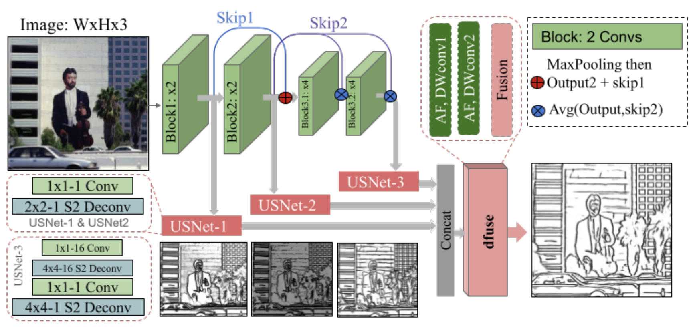

# Color-Books

Color Books is a Python-based repository designed to create coloring pages from images. With a user-friendly web interface, you can easily process your images and transform them into delightful coloring pages via Django-written server. 

## Installation

| Step | Instruction                                                            |
|------|------------------------------------------------------------------------|
| 1    | Install requirements by running: `pip install -r requirements.txt`  |
| 2    | Set your `SECRET_KEY` in `image_clustering/settings.py`               |
| 3    | Set your real checkpoint path in `image_processing/models.py` as parameter of `process_test_single_image()` |
| 4    | Run server with with command:  `python manage.py runserver`                         |
---

## Image Processing Methods

Color Books offers two methods of image to color page processing:
1. **K-Means Clustering with Thresholding:** This method segments the image into clusters based on color similarity using the K-Means algorithm. Thresholding is then applied to the gradient magnitude image obtained from Sobel edge detection to extract edges and create distinct regions suitable for coloring.

2. **TEED:** The [TEED](https://arxiv.org/abs/2308.06468) is a lightweight CNN discovered by Xavier Soria et al. with architechure as described: 

## TEED
The service uses the result of the 20th epoch, different epochs weights could be found in the `TEED/checkpoints/BIPED` directory
### Dataset 
TEED was trained on augmented BIPED dataset with ~10k images. [Dataset link Kaggle](https://www.kaggle.com/datasets/komilakurbanova/bipedv2-augmented)
